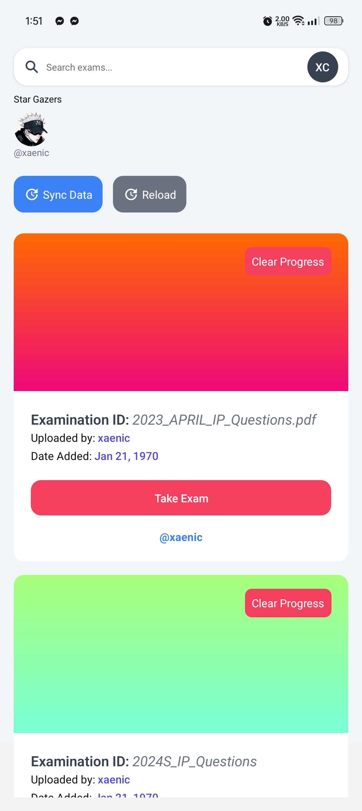
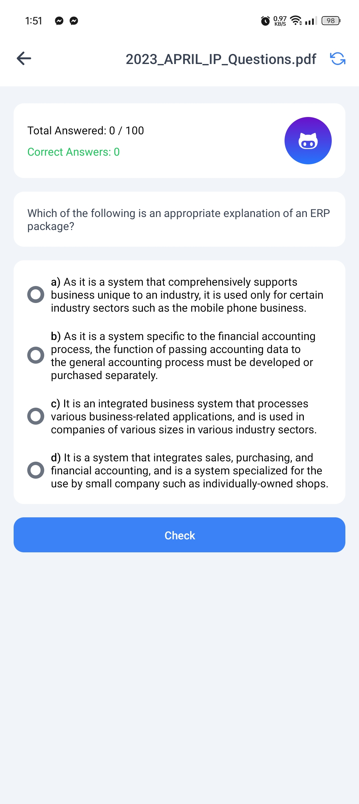
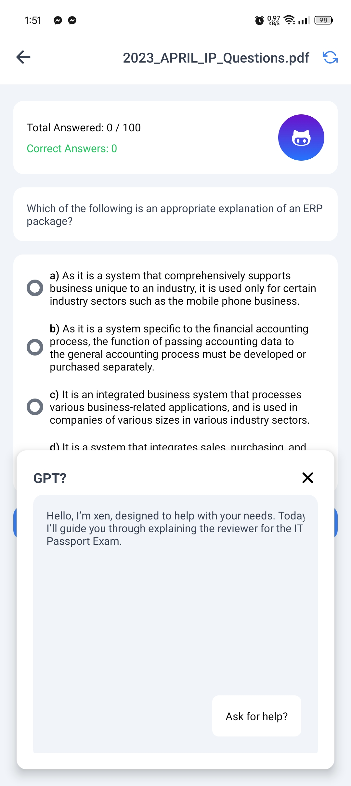

# IT Passport Quiz App

## Overview

The IT Passport Quiz App is designed to help users prepare for the IT Passport Examination. This app provides a variety of questions covering different topics relevant to the exam, allowing users to test their knowledge and track their progress.

## Features

- **Question Bank**: A comprehensive set of questions covering various topics in the IT Passport Examination.
- **Progress Tracking**: Track your progress and see how many questions you have answered correctly.
- **Image Support**: Some questions come with images to provide a more comprehensive understanding.
- **Offline Support**: Access your progress and questions even when you are offline.
- **User Authentication**: Secure login and registration to keep your progress safe.
- **Responsive Design**: Optimized for both Android and iOS devices.

## Screenshots

## Download

You can download the IT Passport Quiz App from the following links:

- [Download](https://expo.dev/artifacts/eas/tXjhdVWa8LBSHMoRsbmWCv.apk)

## Technologies Used

- **React Native**: For building the mobile application.
- **Expo**: For development and deployment.
- **Firebase**: For backend services including authentication and data storage.
- **AsyncStorage**: For local storage of user data.
- **Tailwind CSS**: For styling the application.

## Contributing

We welcome contributions from the community. If you would like to contribute, please fork the repository and submit a pull request.

## License

This project is licensed under the MIT License. See the [LICENSE](LICENSE) file for more details.

## Contact

For any questions or feedback, please contact us at support@itpassportquizapp.com.
